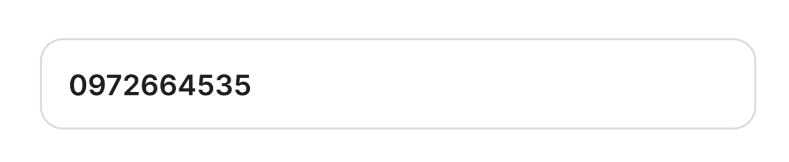

<picture>
  
</picture>
<p align='center'>
    
    
    
    
    
    
    
    <a href='https://www.facebook.com/trinh.vomai/'></a>
</p>

iTextField want to bring an iOS textfield framework, easy to using for developer.

# Requirements :gear:

- iOS 16.

# Supported Platforms :iphone:

- iOS 15.0.

# Installation :computer:

### Swift Package Manager
[Swift Package Manager](https://swift.org/package-manager/) is a tool for automating the distribution of Swift code and is integrated into the `swift` compiler. Once you have your Swift package set up, adding `SkeletonUI` as a dependency is as easy as adding it to the `dependencies` value of your `Package.swift`.

```swift
  dependencies: [
  .package(url: "https://github.com/iVoGia/iTextField.git", .branch("master"))
  ]
```

# Features :sparkles:

- [x] Custom Textfield.

# Usage :rocket:

### Basic one-liner:

```swift
import iTextField
import SwiftUI

struct UsersView: View {
    @State var phone: String = ""
    var body: some View {
        AppPhoneTextField(titleString: Binding(get: {return "Phone"}, set: {_ in}),
             placeholderString: Binding(get: {return "Enter phone number"}, set: {_ in}),
             valueString: $phone)
    }
}
```

# Change Log :calendar:

See [CHANGELOG.md](url) for details.

# Contributing :tada:

- Suggest your idea as a [feature request](https://github.com/iVoGia/iTextField/issues/new?assignees=&labels=&template=feature_request.md&title=) for this project.
- Create a [bug report](https://github.com/iVoGia/iTextField/issues/new?assignees=&labels=&template=bug_report.md&title=) to help us improve.
- Propose your own fixes, suggestions and open a pull request with the changes.

# License :mortar_board:

SkeletonUI is released under the MIT license. See [LICENSE](url) for details.
